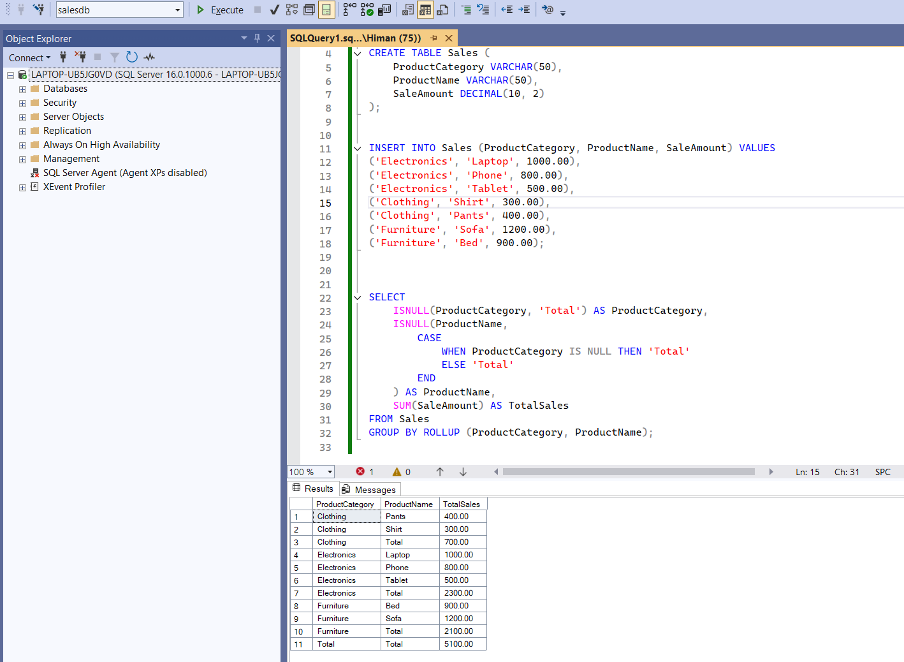

# Sales Report using SQL Server ROLLUP

This project generates a sales summary report using the `ROLLUP` function in SQL Server.

## 📌 Features

- Shows sales per product
- Subtotals by product category
- Overall total sales

## 🗃️ Table Structure

- `ProductCategory`: Category of the product
- `ProductName`: Name of the product
- `SaleAmount`: Sales amount

## 🧪 Sample Data Used

Includes Electronics, Clothing, and Furniture products with respective sales amounts.

## 📊 Output Screenshot

